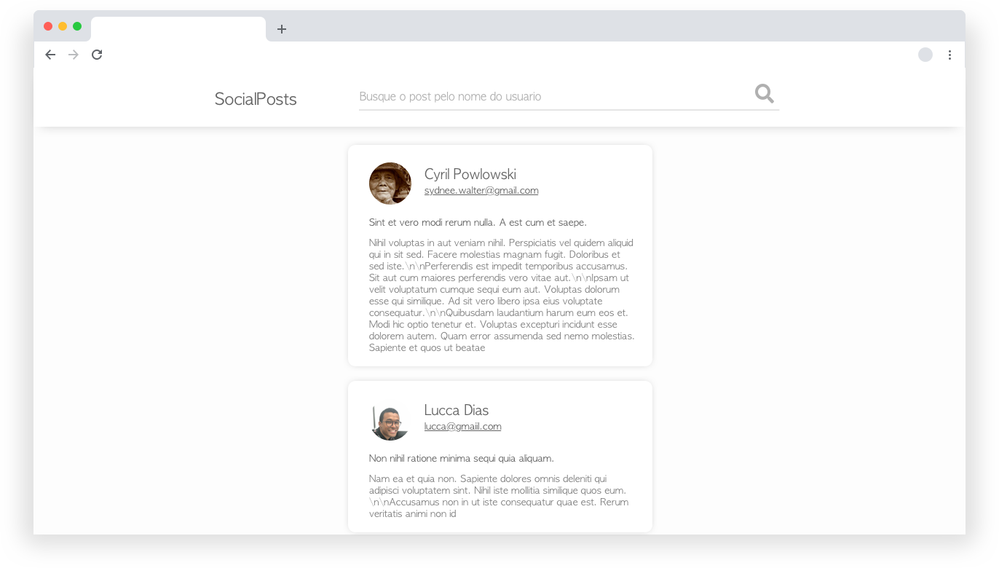

 
 ##### - Listar todos os post`s ( Criar card com a foto do usuario, nome, titiulo e texto ).
 ##### - Funcionalidade de buscar por nome do usuario
 ##### - Siga o Design para desenvolvimento do style
 
 ### API [GoRest](https://gorest.co.in/)
  - Para essa etapa utilize Apenas essas rotas:
``/public-api/users``
``/public-api/posts``

  - O ```GET``` de Posts não retorna a imagem do usuario, para isso você vai precisar buscar um usuario especifico na rota ``/public-api/users/$IdUser``
  
  - Não esqueça de se cadastrar no site para pegar a autorização da API. 
  Obs: Token de autorização precisa colocar no header.

### Design da aplicação:
```css
  font-family: AppleGothic,

  # Title NavBar
  color: #646464,
  placeholder: rgba(100, 100, 100, 0.6)

  # Title Post
  color: #646464,

  # Text Post
  color: #646464,
  opaticy: 0.8
```

